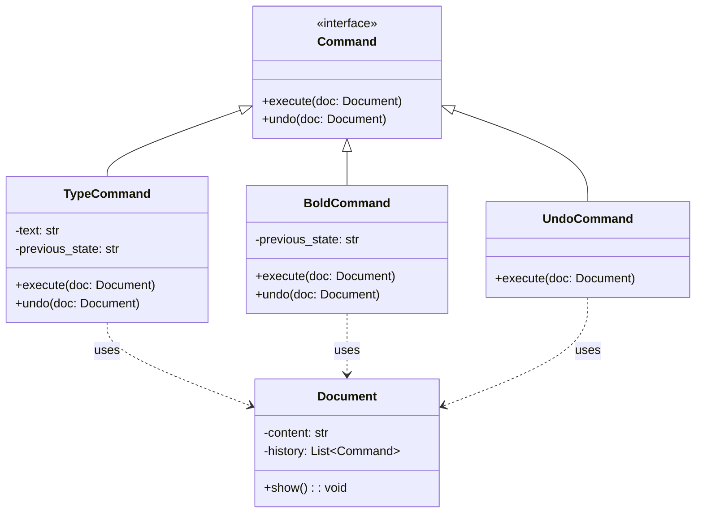

# 🧠 Command Pattern with Undo – Python Text Editor Example

---

## 📘 Overview

The **Command Pattern** is a behavioral design pattern that turns a request into a standalone object containing all the information needed to perform the action later.  
This pattern:

- Decouples the object that **invokes** a command from the one that **executes** it.
- Enables support for **undo**, **redo**, **queueing**, and **macro operations**.

---

## 🎯 Problem It Solves

In many systems (like text editors), you want to:

- Issue commands without tightly coupling them to how the action is performed
- Track a history of operations
- Implement **undo/redo functionality**
- Support multiple types of commands dynamically

---
## 🧱 UML Diagram

